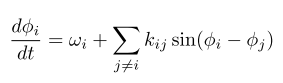
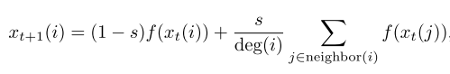
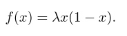
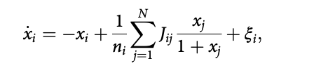

## Tools for reconstruction methods / dynamics models and data

我们在这个库中整理了常用的网络重构 / 因果推断方法，网络上的数据生成方法及可用于网络重构/因果推断和动力学学习的数据，本项目保持持续更新

<hr/>

## 目录

- 动力学模型
	- <a href="#11">Kuramoto Model</a>
	- <a href="#12">Coupled Map Lattice(CML) Model</a>
	- <a href="#12">Michaelis–Menten kinetics Model</a>
- 网络重构/因果推断方法
- 常用数据

## 动力学模型

<div id="11"></div>
<hr/>

### Kuramoto Model

**介绍**

Kuramoto Model又称藏本模型，是一种用来用来描述大量耦合振子同步行为的数学模型，大量相互作用元素群体中的同步现象是物理、生物、化学和社会系统中密集研究的主题。一个简单的例子是萤火虫的闪烁趋于同步的现象<a href="https://zhuanlan.zhihu.com/p/29620506">（萤火虫的同步现象）</a>，Kuramoto解决同步问题的方法是将系统的每一个主体建模为一个相位振荡器，这个模型假设，所有振子都是完全相同的，相互之间的耦合很弱、并且任意两个振子之间的相互作用强度取决于它们相位差的正弦。这个模型原本是为了描述化学振子、生物振子而构建，后发现具有广泛的应用。

**Learn More**

论文：<a href="http://scala.uc3m.es/publications_MANS/PDF/finalKura.pdf">The Kuramoto model: a simple paradigm for synchronization phenomena</a>

Wikipedia：<a href="https://zh.wikipedia.org/wiki/藏本模型">Kuramoto Model</a>

百度百科：<a href="https://baike.baidu.com/item/藏本模型/23224129">藏本模型</a>


**动力学方程**



其中，phi表示不同节点的相位，omega表示节点的固有频率，k表示节点之间的耦合强度

**模型地址**
```
./dyn_model/kuramoto/
```

**数据生成**
```
python dyn_models/kuramoto/data_generator_kuramoto.py
```

**数据说明**

- 运行上述方法会将生成数据存储于dyn_model/kuramoto文件夹下
- 数据格式为4维numpy array，形如[sample num, node num, timestep, feature]
	- 第1维：重新初始化的次数，可调
	- 第2维：节点数，可调
	- 第3维：每次初始化后的迭代步数，可调
	- 第4维：节点信息，相位和速度，维度维2，不可调
- 可在模型参数配置中设置底层的网络结构为ER随机图，无标度网络，小世界网络，并可设置网络参数，具体在代码内部，参数设置处有说明


<div id="12"></div>
<hr/>

#### Coupled Map Lattice(CML) Model


**介绍**

Coupled Map Lattice（又称耦合晶格模型）是一个描述非线性系统的动力学模型，主要用于研究时空混沌动力学。耦合晶格模型是一个典型的离散动力学模型，在离散特征方面，耦合晶格模型有些类似元胞自动机，每一个元胞自动机的状态只依赖于他的邻居。在耦合晶格系统中，每一个节点的状态也只取决于与他耦合的邻居，对耦合晶格模型的研究可以帮助我们理解诸多现实系统，如种群，化学，生物等。

**Learn More**

图书：<a href="https://books.google.com/books?hl=zh-CN&lr=&id=a63Q8DhKA44C&oi=fnd&pg=PA1&dq=+Chazottes,+Jean-René,+and+Bastien+Fernandez.+Dynamics+of+Coupled+Map+Lattices+and+of+Related+Spatially+Extended+Systems.+Springer,+2004.+pgs+1–4&ots=HmPpMnZ1s4&sig=1M1WcKzG0bRp1BzQ6kau-H1QIiE"> Chazottes, Jean-René, and Bastien Fernandez. Dynamics of Coupled Map Lattices and of Related Spatially Extended Systems. Springer, 2004. pgs 1–4</a>

Wikipedia：<a href="https://en.wikipedia.org/wiki/Coupled_map_lattice">Coupled Map Lattice</a>

**动力学方程**



其中X表示节点的位置，s表示耦合常数，f(x)表示logistic映射函数，其具体形式如下：




**数据说明**

- 运行上述方法会将生成数据存储于dyn_model/cml文件夹下
- 数据格式为4维numpy array，形如[sample num, node num, timestep, feature]
	- 第1维：重新初始化的次数，可调
	- 第2维：节点数，可调
	- 第3维：每次初始化后的迭代步数，可调
	- 第4维：节点位置，维度维1，不可调
- 除生成基本数据外，此代码还将同时生成切割后的数据，并将按照5:1:1的比例分别存储为训练集，测试集，校验集，可以用于多步预测
	- 关于切割及多步预测细节，可咨询刘晶


#### Michaelis–Menten kinetics


**介绍**

Michaelis–Menten kinetics 是一个基因调控网络

**Learn More**

论文：<a href=https://www.nature.com/articles/nrm2503> 
	
论文：<a href=https://www.nature.com/articles/nbt.2601>

**动力学方程**



其中ni表示节点的邻居节点个数，Jij表示从j到i的有向连接

**模型地址**
```
./dyn_model/menten
```

**数据生成**
```
python dyn_models/menten.py
```

**数据说明**

- 运行上述方法会将生成数据存储于dyn_model/cml文件夹下
- 数据格式为4维numpy array，形如[timestep, node num, dim]
	- 第1维：每次初始化后的迭代步数，可调
	- 第2维：节点数，可调
	- 第3维：维度维1，不可调
- 除生成基本数据外，此代码还将同时生成切割后的数据，并将按照5:1:1的比例分别存储为训练集，测试集，校验集


