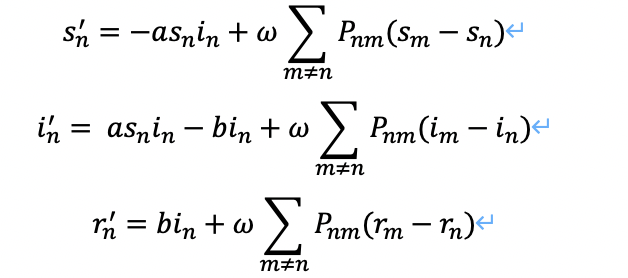

## Tools for reconstruction methods / dynamics models and data

我们在这个库中整理了常用的网络重构 / 因果推断方法，网络上的数据生成方法及可用于网络重构/因果推断和动力学学习的数据，本项目保持持续更新

<hr/>

## 目录

- 动力学模型
	- <a href="#11">Kuramoto Model</a>
	- <a href="#12">Coupled Map Lattice(CML) Model</a>
	- <a href="#13">Michaelis–Menten kinetics Model</a>
	- <a href="#14">SIR</a>
	- <a href="#15">Voter模型</a>
	- <a href="#16">N-K自动机</a>
	- <a href="#17">网络上的人工股票市场</a>
	- <a href="#18">网络上的人工股票市场（Pastore模型）</a>
	- <a href="#19">Spring System</a>
	- <a href="#20">格点网络上的热扩散</a>
- 网络重构/因果推断方法
	- 代码公开方法
		- 对于很多经典的方法，如格兰杰因果检验，相关性，互信息等，网上已经存在着开源代码，甚至封装好了可以直接给我们调用的库，<a href="https://netrd.readthedocs.io/en/latest/index.html">Netrd</a>就是这样的一个代码库。我们可以在其中找到很多经典的网络重构方法，如：
		- <a href="https://netrd.readthedocs.io/en/latest/reconstruction.html#netrd.reconstruction.PartialCorrelationInfluence">Partial Correlation Inference</a>
		- <a href="https://netrd.readthedocs.io/en/latest/reconstruction.html#netrd.reconstruction.ConvergentCrossMapping">Convergent Cross Mapping</a>
		- <a href="https://netrd.readthedocs.io/en/latest/reconstruction.html#netrd.reconstruction.GrangerCausality">Granger Causality</a>
		- <a href="https://netrd.readthedocs.io/en/latest/reconstruction.html#netrd.reconstruction.MutualInformationMatrix">Mutual Information Matrix</a>
		- 其他的方法请见netrd官方文档，如果我们要复现某个新的方法，也请先去查看文档中是否已经存在着封装好的库，以免重复劳动
	- <a href="#21">ARNI</a>
	- <a href="#22">使用压缩感知方法重构SIS动力学（Responsible：高飞）</a>
- 常用数据
	- 新冠病毒数据（Responsible：Jake）


## 动力学模型

<div id="11"></div>
<hr/>

### Kuramoto Model

**介绍**

Kuramoto Model又称藏本模型，是一种用来用来描述大量耦合振子同步行为的数学模型，大量相互作用元素群体中的同步现象是物理、生物、化学和社会系统中密集研究的主题。一个简单的例子是萤火虫的闪烁趋于同步的现象<a href="https://zhuanlan.zhihu.com/p/29620506">（萤火虫的同步现象）</a>，Kuramoto解决同步问题的方法是将系统的每一个主体建模为一个相位振荡器，这个模型假设，所有振子都是完全相同的，相互之间的耦合很弱、并且任意两个振子之间的相互作用强度取决于它们相位差的正弦。这个模型原本是为了描述化学振子、生物振子而构建，后发现具有广泛的应用。

**Learn More**

论文：<a href="http://scala.uc3m.es/publications_MANS/PDF/finalKura.pdf">The Kuramoto model: a simple paradigm for synchronization phenomena</a>

Wikipedia：<a href="https://zh.wikipedia.org/wiki/藏本模型">Kuramoto Model</a>

百度百科：<a href="https://baike.baidu.com/item/藏本模型/23224129">藏本模型</a>


**动力学方程**


其中，phi表示不同节点的相位，omega表示节点的固有频率，k表示节点之间的耦合强度

**模型地址**
```
./dyn_model/kuramoto/
```

**数据生成**
```
python dyn_models/kuramoto/data_generator_kuramoto.py
```

**数据说明**

- 运行上述方法会将生成数据存储于dyn_model/kuramoto文件夹下
- 数据格式为4维numpy array，形如[sample num, node num, timestep, feature]
	- 第1维：重新初始化的次数，可调
	- 第2维：节点数，可调
	- 第3维：每次初始化后的迭代步数，可调
	- 第4维：节点信息，相位和速度，维度维2，不可调
- 可在模型参数配置中设置底层的网络结构为ER随机图，无标度网络，小世界网络，并可设置网络参数，具体在代码内部，参数设置处有说明


<div id="12"></div>
<hr/>

### Coupled Map Lattice(CML) Model


**介绍**

Coupled Map Lattice（又称耦合晶格模型）是一个描述非线性系统的动力学模型，主要用于研究时空混沌动力学。耦合晶格模型是一个典型的离散动力学模型，在离散特征方面，耦合晶格模型有些类似元胞自动机，每一个元胞自动机的状态只依赖于他的邻居。在耦合晶格系统中，每一个节点的状态也只取决于与他耦合的邻居，对耦合晶格模型的研究可以帮助我们理解诸多现实系统，如种群，化学，生物等。

**Learn More**

图书：<a href="https://books.google.com/books?hl=zh-CN&lr=&id=a63Q8DhKA44C&oi=fnd&pg=PA1&dq=+Chazottes,+Jean-René,+and+Bastien+Fernandez.+Dynamics+of+Coupled+Map+Lattices+and+of+Related+Spatially+Extended+Systems.+Springer,+2004.+pgs+1–4&ots=HmPpMnZ1s4&sig=1M1WcKzG0bRp1BzQ6kau-H1QIiE"> Chazottes, Jean-René, and Bastien Fernandez. Dynamics of Coupled Map Lattices and of Related Spatially Extended Systems. Springer, 2004. pgs 1–4</a>

Wikipedia：<a href="https://en.wikipedia.org/wiki/Coupled_map_lattice">Coupled Map Lattice</a>

**动力学方程**


其中X表示节点的位置，s表示耦合常数，f(x)表示logistic映射函数，其具体形式如下：


**模型地址**
```
./dyn_model/cml/
```

**数据生成**
```
python dyn_models/cml/data_generator_cml.py
```


**数据说明**

- 运行上述方法会将生成数据存储于dyn_model/cml文件夹下
- 数据格式为4维numpy array，形如[sample num, node num, timestep, feature]
	- 第1维：重新初始化的次数，可调
	- 第2维：节点数，可调
	- 第3维：每次初始化后的迭代步数，可调
	- 第4维：节点位置，维度维1，不可调
- 除生成基本数据外，此代码还将同时生成切割后的数据，并将按照5:1:1的比例分别存储为训练集，测试集，校验集，可以用于多步预测
	- 关于切割及多步预测细节，可咨询刘晶


<div id="13"></div>
<hr/>

### Michaelis–Menten kinetics


**介绍**

Michaelis–Menten kinetics 米-门二氏动2113力学：一种非线性动力学模式,描述酶促反应动力学的方程式,它们可以从描述相关分子物种浓度变化的常微分方程中推导出来，只需要一些简化的假设。


论文：<a href="https://www.nature.com/articles/nbt.2601">Network link prediction by global silencing of indirect correlations</a>


论文：<a href="https://www.nature.com/articles/nrm2503">Modelling and analysis of gene regulatory networks</a>


**动力学方程**


其中ni表示节点的邻居节点个数，Jij表示从j到i的有向连接


**模型地址**

```
./dyn_model/menten
```

**数据生成**

```
python dyn_models/menten.py
```

**数据说明**


- 运行上述方法会将生成数据存储于dyn_model文件夹下
- 数据格式为3维numpy array，形如[timestep, node num, dim]
	- 第1维：表示每次初始化后的迭代步数，可调
	- 第2维：表示节点（化合物/基因）个数，可调
	- 第3维：表示浓度，维度为1，不可调

### SIR

**介绍**

SIR模型是一种传播模型，是信息传播过程的抽象描述。
SIR模型是传染病模型中最经典的模型，其中S表示易感者，I表示感染者，R表示移除者。
S：Susceptible，易感者
I：Infective，感染者
R：Removal，移除者
传播过程大致如下：最初，所有的节点都处于易感染状态。然后，部分节点接触到信息后，变成感染状态，这些感染状态的节点试着去感染其他易感染状态的节点，或者进入恢复状态。感染一个节点即传递信息或者对某事的态度。恢复状态，即免疫，处于恢复状态的节点不再参与信息的传播。

论文：<a href="https://link.springer.com/article/10.1007/s11071-020-05769-2">Investigating time, strength, and duration of measures in controlling the spread of COVID-19 using a networked meta-population model</a>


**动力学方程**



Sn，In，Rn 是这些状态的总体，sn , in , rn 分别是这些状态的相对分数。sn= Sn / Nn, in = In / Nn, rn = Rn / Nn 分别是城市 n 中敏感个体、确认个体、恢复个体的分数，Nn是城市 n 的人口规模。P是根据迁移数据计算的迁移矩阵，0 ≤ P mn ≤ 1表示从城市 n 向城市 m 迁移的比例，占离开城市 n 的总人口的比例。其中a是感染率，b是康复率。

**模型地址**

```
./dyn_model/SIR——new/
```

**数据生成**

```
python dyn_models/SIR——new/SIR_generator.py
```

**数据生成说明**

data_path:存放数据的路径
运行上述方法会将生成的数据存储于data_path路径下
数据格式为3维numpy array，形如[time_steps,node num,feature]
第一维：运行完上述方法总共生成多少时间步的数据，可调，
第二维：节点的数量，371（迁徙数据中包含371个城市），不可调
第三维：节点信息，包含S I R 三个信息，维度为3，不可调

time_steps调整方式：通过修改代码中的 ‘--times’参数，time_steps = times *10  （其他参数尽量不要随意改动）
注：本数据生成采用的底层网络结构是全国城市人口的迁徙数据

**数据加载说明**

在数据加载过程中，会根据实际问题，将原本的数据格式[time_steps,node num,feature] 变为[time_steps//prediction_steps,prediction_steps,node num,feature]

第一维：受prediction_steps影响，最后会形成多少个时间对
第二维：prediction_steps 当前实验要做的是几步预测，可调。如果是单步预测，prediction_steps 设置为2；如果是双步预测，prediction_steps 设置为3；以此类推...
第三维：节点的数量，371（迁徙数据中包含371个城市），不可调
第四维：节点信息，包含S I R 三个信息，维度为3，不可调


<div id="11"></div>
<hr/>

### Voter Model

**介绍**

投票动力学模型是观点传播动力学（opinion dynamics）模型类中的简单模型，他的机制如下：在t时刻，节点i会随机选取一个邻居节点j，用j在t-1时刻的状态来代替自己t时刻的状态。

**Learn More**


**动力学方程**


**模型地址**
```
./dyn_model/voter/
```

**数据生成**
```
可直接参考voter内的ipynb文件
```

**数据说明**

- 运行上述方法会将生成数据存储于dyn_model/voter文件夹下
- 数据格式为3维numpy array，形如[sample num, timestep, node]
	- 第1维：重新初始化的次数，可调
	- 第2维：节点数，可调
	- 第3维：每次初始化后的迭代步数，可调
	- 节点上的信息为0或1
- 可在模型参数配置中设置底层的网络结构为无标度网络或小世界网络，并可设置网络参数，具体在代码内部，参数设置处有说明


### 格点网络上的热扩散

**介绍**


[Neural Dynamics on Complex Networks](https://arxiv.org/abs/1908.06491) grid 邻接矩阵 + 热扩散动力学

### Glauber dynamics

**介绍**

See `./dyn_model/GlauberDynamics/demo.ipynb` for the introduction of Glauber dynamics and how to generate data. Besides, we also provide how to do exact reconstruction by maximum likelihood estimation and the Naive Mean-field solution.

**模型地址**
```
./dyn_model/GlauberDynamics
```

**数据生成**

See `./dyn_model/GlauberDynamics/demo.ipynb`.


## 网络重构 / 因果推断方法
<div id="21"></div>
<hr/>
### ARNI- Algorithm for Revealing Network Interactions


**介绍**

网络相互作用揭示算法(ARNI)是文章中使用的非线性集体动力学直接网络相互作用的无模型推断算法，基于非线性集体动力学，ARNI 揭示了网络的交互拓扑结构，既没有假设特定的动力学模型是已知的，也没有假设动力学模型是稀疏表示的，也没有在网络上强加受控的驱动。

在这个存储库中，您将找到用 Matlab 和 Python 实现的示例代码和函数。


论文：<a href="https://www.nature.com/articles/s41467-017-02288-4">Model-free inference of direct network interactions from nonlinear collective dynamics</a>


**动力学方程**


**模型地址**

```
./ARNI/ARNI_Python/ARNIpy/reconstruct.py 
```

**文件说明**

有两个版本：matlab python
python中reconstruct.py文件是整合后的版本可以直接运行
python中menten_ARNI是生成数据文件，生成的是menten动力学

<div id="22"></div>
<hr/>

### 使用压缩感知方法重构SIS动力学

**读书会回放**
<a href="https://campus.swarma.org/course/1740/study">https://campus.swarma.org/course/1740/study（第五章）</a>

高飞正在进行中


<div id="23"></div>
<hr/>

### CCM方法

**读书会回放**
<a href="https://campus.swarma.org/course/1740/study">https://campus.swarma.org/course/1740/study（第七章）</a>


